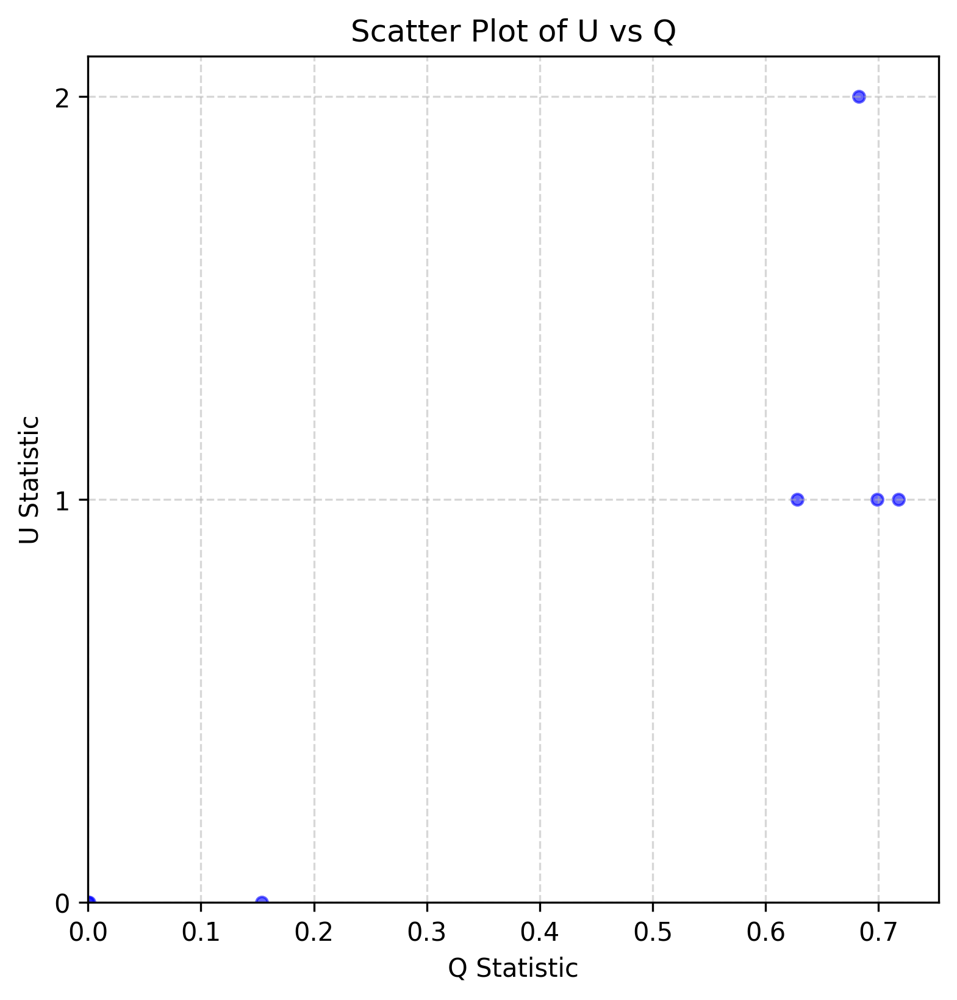

# Make Plots

`sai` provides the `plot` command to generate a scatter plot of U statistic values versus Q statistic values for each genomic window.

To view the available options, we can run:

```
sai plot -h
```

This will show information for each argument:

| Argument | Description |
| - | - |
| -h, --help     |  show this help message and exit |
| --u-file       |  Path to the U score/outlier file. |
| --q-file       |  Path to the Q score/outlier file. |
| --output       |  Path to save the output plot file. The format depends on the file extension (e.g., `.png`, `.pdf`). |
| --xlabel       |  Label for the X-axis. Default: Q Statistic. |
| --ylabel       |  Label for the Y-axis. Default: U Statistic. |
| --title        |  Title of the plot. Default: Scatter Plot of U vs Q. |
| --figsize-x    |  Width of the figure (in inches). Default: 6. |
| --figsize-y    |  Height of the figure (in inches). Default: 6. |
| --dpi          |  Resolution of the saved plot. Default: 300. |
| --alpha        |  Transparency level of scatter points. Default: 0.6. |
| --marker-size  |  Size of the scatter plot markers. See matplotlib.pyplot.scatter. Default: 20. |
| --marker-color |  Color of the markers. See matplotlib.pyplot.scatter. Default: blue. |
| --marker-style |  Shape of the markers. See matplotlib.pyplot.scatter. Default: o. |

## Input files

Two input files are required: one containing U statistic values and one containing Q statistic values. These files can be generated by either the score or outlier command.

## Output files

The output file is a scatter plot showing U versus Q statistic values for each genomic window.

## Examples

To plot the U statistics versus Q95 statistic values for genomic windows for detecting introgressed variants from both Neanderthals and Denisovans, we can run the following:

```
sai plot --u-file examples/results/1KG.nea_den.chr9.example.both.U50.scores.tsv \
         --q-file examples/results/1KG.nea_den.chr9.example.both.Q95.scores.tsv \
         --output examples/results/1KG.nea_den.chr9.example.both.U50.vs.Q95.scores.png
```

A file ending with `.overlap.tsv` (e.g., [1KG.nea_den.chr9.example.both.U50.vs.Q95.scores.overlap.tsv](https://github.com/xin-huang/sai/blob/main/examples/results/1KG.nea_den.chr9.example.both.U50.vs.Q95.scores.overlap.tsv)) is also generated. This file contains:

- The U and Q scores for the overlapping genomic intervals used in the plot;
- The candidates shared between the two input files that also meet the specified conditions within those intervals.

The resulting plot is shown below:


